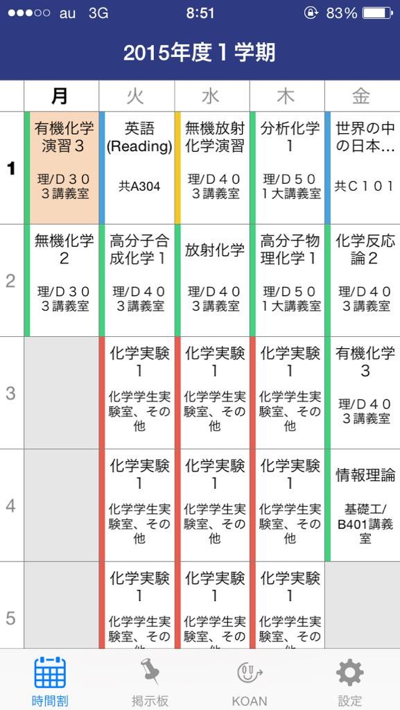
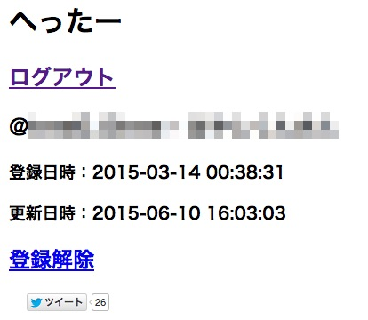
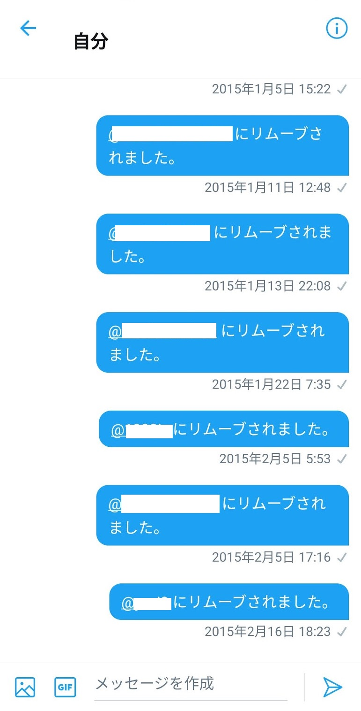

# Ryosuke Hayashi

Blog: https://blog.hayashikun.com/

## Works

### fugaku36 (2020)
- https://github.com/hayashikun/fugaku36

Language: Python

Update desktop background image every day with randomly selected `Thirty-six Views of Mount Fuji` for macOS.

### Enigma (2019)
- https://hayashikun.github.io/Enigma/
- https://github.com/hayashikun/Enigma

Language: Typescript (React.js)

Enigma (encryption device) web simulator

### TEDxOsakaU (2018)
- http://www.tedxosakau.com/

Language: Typescript (Vue.js)

TEDxOsakaU official website

### KOAN for iOS, for Android (2014-2017)

Languages: Swift, Java

 

 

### へったー (2015-2017)

Language: Python

Send notification who unfollowed you on twitter

